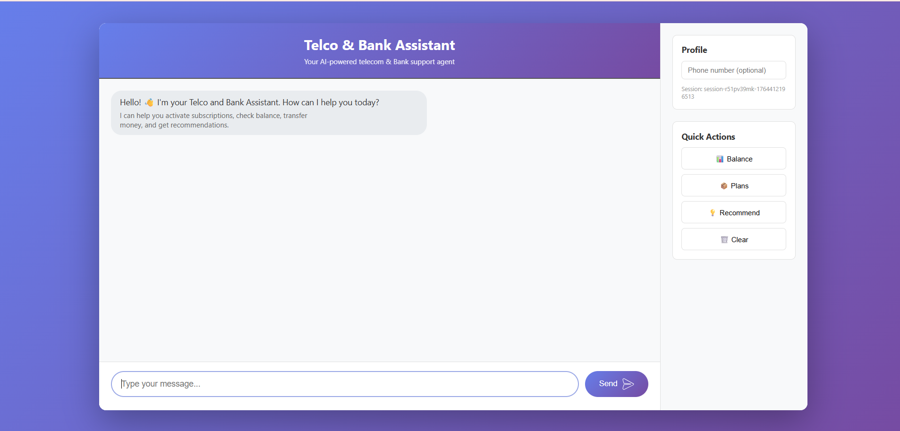
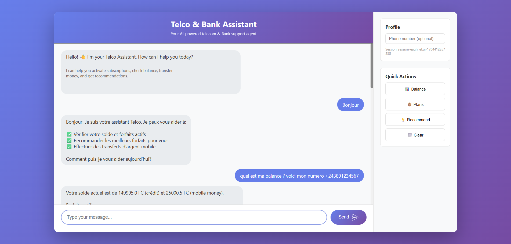

# Build a Natural Language AI Assistant for Telco Services with Amazon Bedrock Multi-Agent

Ever wondered how to build a smart chatbot that can handle complex client needs in natural language? One that doesn't just answer questions but actually performs actions - activating subscriptions, transferring money, checking balances? In this tutorial, we'll build exactly that using Amazon Bedrock's multi-agent architecture.

Instead of cramming everything into one giant agent, we'll create specialized agents that work together like a real customer service team. Each agent is an expert in their domain, and a router agent orchestrates who handles what.

**📦 Full code:** [GitHub Repository](https://github.com/mbulamboma/Multi-AI-agent-Communication-for-Bank-and-Telco-Services)

## What We're Building

A conversational AI system where users can:
- Check their account balance
- Activate data/voice subscriptions
- Transfer money to other users
- Get personalized plan recommendations

All through natural conversation. Just type "Check my balance" or "Transfer 500 to +243859876543" and the system handles the rest.

## Architecture Overview


The system uses a **router-based multi-agent architecture** where:
- **Client** accesses a chat interface hosted on S3 (via CloudFront + WAF for security)
- **Frontend** sends requests to an Agent API Gateway
- **Router Agent** (Bedrock) receives the request and delegates to specialized agents:
  - **Subscription Agent** - Handles plan activations
  - **Money Transfer Agent** - Manages transfers
  - **Recommendation Agent** - Suggests plans
- **Specialized Agents** call action groups (Lambda functions via Business API Gateway)
- **Lambda Functions** interact with DynamoDB for data persistence

## Prerequisites

- AWS Account (obviously)
- Basic knowledge of Lambda, API Gateway, and DynamoDB
- Python 3.9+
- AWS CLI configured
- Clone the repository: 
  ```bash
  git clone https://github.com/mbulamboma/Multi-AI-agent-Communication-for-Bank-and-Telco-Services.git
  cd Multi-AI-agent-Communication-for-Bank-and-Telco-Services
  ```

## Step 1: Set Up DynamoDB Tables

We need two tables for our data.

### Table 1: TelcoData (User Data)

```bash
aws dynamodb create-table \
  --table-name TelcoData \
  --attribute-definitions \
    AttributeName=PK,AttributeType=S \
    AttributeName=SK,AttributeType=S \
  --key-schema \
    AttributeName=PK,KeyType=HASH \
    AttributeName=SK,KeyType=RANGE \
  --billing-mode PAY_PER_REQUEST
```

**Structure:**
- `PK`: `USER#{phone_number}`
- `SK`: `METADATA` (user profile) or `TRANS#{timestamp}` (transactions)

### Table 2: Catalog (Subscription Plans)

```bash
aws dynamodb create-table \
  --table-name Catalog \
  --attribute-definitions \
    AttributeName=PK,AttributeType=S \
    AttributeName=SK,AttributeType=S \
  --key-schema \
    AttributeName=PK,KeyType=HASH \
    AttributeName=SK,KeyType=RANGE \
  --billing-mode PAY_PER_REQUEST
```

**Structure:**
- `PK`: Category (`DATA`, `VOICE_SMS`, `PACK`)
- `SK`: Plan ID (e.g., `F_D_1GB`)

### Seed Some Data

Load the sample data into your tables:

```bash
# Import Catalog data
aws dynamodb batch-write-item --request-items file://database/Catalog.csv

# Import TelcoData 
aws dynamodb batch-write-item --request-items file://database/TelcoData.csv
```

Or use the AWS Console to import the CSV files directly:
1. Go to DynamoDB → Tables → Your Table
2. Actions → Import from S3
3. Upload `database/Catalog.csv` and `database/TelcoData.csv`

**Sample users in TelcoData.csv:**
- `+243891234567` - Has 1GB data plan, $15.75 credit, $25,000 mobile money
- `+243851112229` - Has Premium plan, negative credit balance
- `+243859876543` - Minimal balance, received a transfer

## Step 2: Create Business Logic Lambda Functions

These are the backend functions that actually do the work.

### Deploy the Lambdas

```bash
cd api-gateway-lambdas
zip check_balance.zip api_check_balance_handler.py
zip activate_sub.zip api_activate_subscription_handler.py
zip transfer_money.zip api_transfer_money_handler.py
zip get_recommendation.zip api_get_subscription_recommendation_handler.py

# Deploy them
aws lambda create-function --function-name check_balance_handler \
  --runtime python3.9 --handler api_check_balance_handler.lambda_handler \
  --role arn:aws:iam::YOUR_ACCOUNT:role/lambda-dynamodb-role \
  --zip-file fileb://check_balance.zip

# Repeat for other functions...
```

Don't forget to give your Lambda execution role DynamoDB permissions!

## Step 3: Set Up Business API Gateway

Create an API Gateway that exposes your Lambda functions.

```bash
aws apigateway import-rest-api \
  --body fileb://api-gateway-lambdas/api-gateway.json
```

This creates endpoints like:
- `/checkBalance`
- `/activateSubscription`
- `/transferMoney`
- `/getSubscriptionRecommendation`

Deploy it and note the invoke URL - you'll need it later.

## Step 4: Create Bedrock Agents

Here's where the magic happens. We'll create specialized agents that talk to our business APIs.

### Create Action Groups

Each agent needs an action group that defines what it can do. These are OpenAPI specs that point to your business API.

Example for the Subscription Agent (`subscription_agent_actions_api.json`):

```json
{
  "openapi": "3.0.0",
  "paths": {
    "/activateSubscription": {
      "post": {
        "operationId": "activateSubscription",
        "parameters": [
          {"name": "phone_number", "required": true},
          {"name": "subscription_id", "required": true}
        ]
      }
    }
  }
}
```

### Create the Agents in Bedrock Console

1. Go to **Bedrock** → **Agents**
2. Create 3 agents:
   - **Subscription Agent**: Handles plan activations
   - **Money Transfer Agent**: Handles money transfers
   - **Recommendation Agent**: Suggests plans

3. For each agent:
   - Add your custom prompt (from `agents/` folder)
   - Create an action group pointing to your business API
   - Deploy and create an alias

4. Create the **Router Agent**:
   - This is the main agent users talk to
   - Add the 3 agents above as collaborators
   - Use the router prompt from `agents/router_agent_prompt.txt`

## Step 5: Create the Chat Frontend Lambda

This Lambda sits between your frontend and the Router Agent.

```bash
cd agent-api-gateway-deployement
zip function.zip ask_agent_prompt_handler.py

aws lambda create-function --function-name ask_agent_prompt \
  --runtime python3.9 --handler ask_agent_prompt_handler.lambda_handler \
  --role arn:aws:iam::YOUR_ACCOUNT:role/lambda-bedrock-role \
  --zip-file fileb://function.zip \
  --environment Variables="{AGENT_ID=YOUR_ROUTER_AGENT_ID,AGENT_ALIAS=YOUR_ALIAS_ID}"
```

**Important:** Replace `YOUR_ROUTER_AGENT_ID` with your actual Router Agent ID from Bedrock.

## Step 6: Set Up Agent API Gateway

Create an API for the frontend to call:

```bash
aws apigateway import-rest-api \
  --body fileb://agent-api-gateway-deployement/agent-api-gateway.json
```

Deploy it and enable CORS (the JSON already has it configured).

## Step 7: Deploy the Frontend

Upload the frontend to S3 with static website hosting.

```bash
aws s3 mb s3://telco-chatbot-frontend
aws s3 website s3://telco-chatbot-frontend --index-document index.html

cd business-frontend
aws s3 cp index.html s3://telco-chatbot-frontend/
aws s3 cp style.css s3://telco-chatbot-frontend/
aws s3 cp script.js s3://telco-chatbot-frontend/
```

Make the bucket public and set the bucket policy:

```json
{
  "Version": "2012-10-17",
  "Statement": [{
    "Sid": "PublicReadGetObject",
    "Effect": "Allow",
    "Principal": "*",
    "Action": "s3:GetObject",
    "Resource": "arn:aws:s3:::telco-chatbot-frontend/*"
  }]
}
```

### Update the Frontend Config

Edit `script.js` and set your Agent API Gateway URL:

```javascript
const API_ENDPOINT = 'https://YOUR-API-ID.execute-api.us-east-1.amazonaws.com/';
```

Re-upload `script.js` to S3.

## Step 8: Test It Out

Open your S3 website URL in a browser. Try these prompts:

- "Check my balance" (add your phone in the sidebar)
- "Activate a 1GB data plan"
- "Transfer 500 to +243859876543"
- "What plan do you recommend for me?"

The Router Agent will figure out which specialized agent to call!

### See It In Action


*The chat interface with natural language interaction*


*Router agent delegating to specialized agents and executing actions*

## Common Issues & Fixes

**CORS Errors:**
- Make sure the API Gateway has CORS enabled
- Check Lambda returns proper CORS headers
- See `CORS_FIX.md` for details

**Agent Not Found:**
- Verify `AGENT_ID` and `AGENT_ALIAS` in Lambda environment variables
- Use `aws bedrock-agent list-agents` to get the correct IDs

**"No response from agent":**
- Check CloudWatch logs for the Lambda
- The agent response parsing might need adjustment
- Make sure your action group URLs are correct

## How It Works

1. User types a message in the chat
2. Frontend sends it to Agent API Gateway
3. Lambda invokes the Router Agent with the prompt
4. Router Agent analyzes the request and delegates to the right specialized agent
5. Specialized agent calls the business API via action group
6. Business Lambda queries/updates DynamoDB
7. Response flows back through the chain
8. Frontend displays the agent's response


## Next Steps

- Add authentication with Cognito
- Deploy frontend to CloudFront for better performance
- Add more agents (billing, support, etc.)
- Implement conversation history storage
- Add file upload for receipts


## Resources

- [Amazon Bedrock Agents Documentation](https://docs.aws.amazon.com/bedrock/latest/userguide/agents.html)
- [Multi-Agent Collaboration](https://docs.aws.amazon.com/bedrock/latest/userguide/agents-multi-agent.html)
- [Database Schema Reference](docs/DATABASE_SCHEMA.md)
- [Troubleshooting Guide](docs/TROUBLESHOOTING.md)

## Project Structure

```
.
├── agents/                          # Agent prompts and configurations
│   ├── router_agent_prompt.txt
│   ├── subscriptions/
│   ├── money-transfer/
│   └── recommandation-agent/
├── api-gateway-lambdas/            # Business logic Lambda functions
│   ├── api_check_balance_handler.py
│   ├── api_activate_subscription_handler.py
│   ├── api_transfer_money_handler.py
│   └── api_get_subscription_recommendation_handler.py
├── agent-api-gateway-deployement/  # Frontend-facing Lambda
│   ├── ask_agent_prompt_handler.py
│   └── agent-api-gateway.json
├── business-frontend/              # S3-hosted web interface
│   ├── index.html
│   ├── style.css
│   └── script.js
└── docs/                          # Technical documentation
    ├── DATABASE_SCHEMA.md
    └── TROUBLESHOOTING.md
```

---

That's it! You now have a production-ready multi-agent AI system. The beauty of this architecture is that you can easily add more specialized agents without touching the router logic. Each agent is independent and can be updated separately.

Questions? Check the docs or AWS forums. Happy building! 🚀
